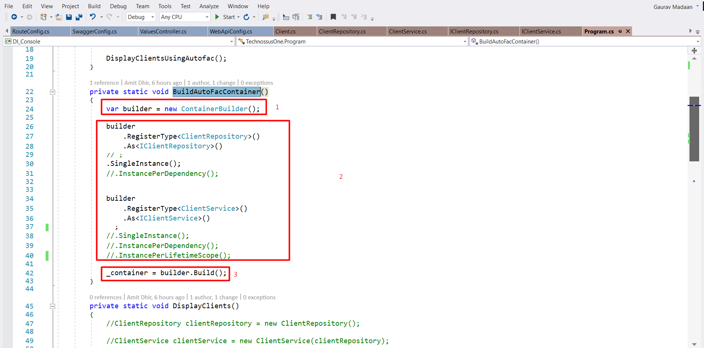
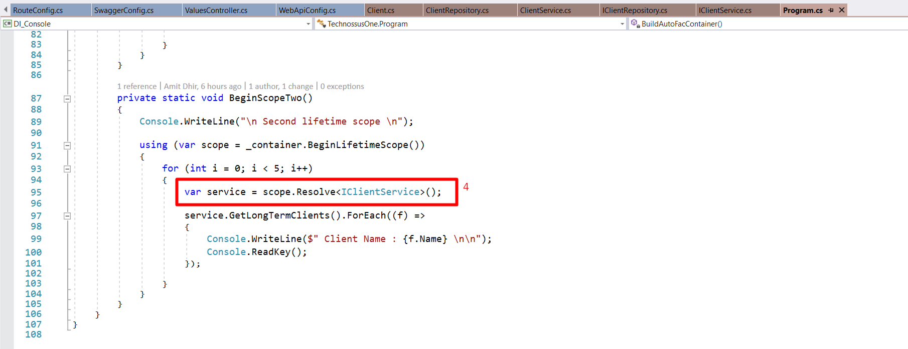

# Understand Dependency Injection

The sample demonstrates dependency injection with Autofac.

## Goals

* Loose Coupling
* Unit Testable Code with easy mocking

## Injection Type

* Constructor Injection
* Property Injection

## Understand Scopes

* Single Instance
* InstancePerDependency (Default with Autofac)
* Lifetime Scope

## DI in just 4 steps

* Create container
* Register dependency
* Build Container

* Resolve dependency
